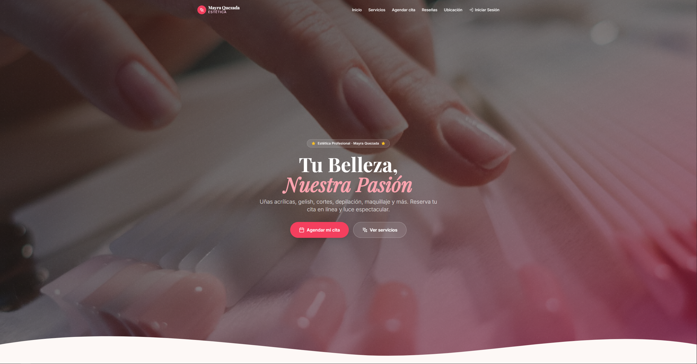
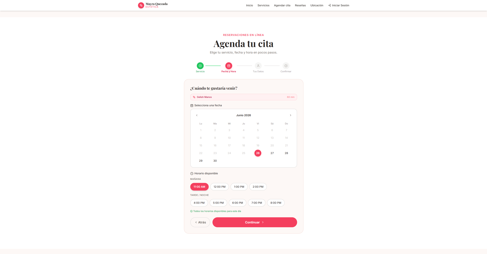
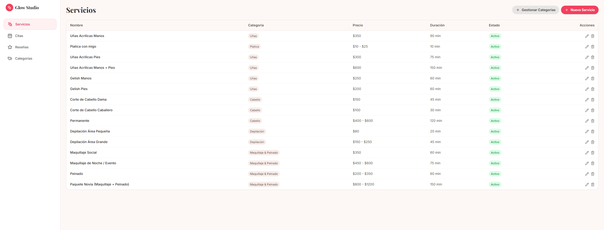

# ✨ Glow Studio

> Sistema completo de gestión para salones de belleza y estética. Permite administrar servicios, reservas, reseñas y clientes desde una plataforma moderna desarrollada con React, TypeScript y Supabase.

---

## 🌟 Descripción

Glow Studio es una solución web diseñada para digitalizar la operación de negocios de estética. Los clientes pueden consultar servicios, reservar citas en línea y compartir reseñas, mientras que el administrador dispone de un panel para gestionar todo el negocio desde un solo lugar.

---

## 🚀 Características Principales

### 👩‍💼 Experiencia para Clientes

* Consulta de servicios disponibles.
* Búsqueda y filtrado por categorías.
* Reservación de citas en línea.
* Sistema de reseñas con calificación por estrellas.
* Ubicación del negocio mediante mapa interactivo.
* Acceso rápido a WhatsApp e Instagram.

### 🛠️ Panel Administrativo

* Gestión completa de servicios.
* Administración de categorías.
* Control de citas y estados de reservación.
* Moderación de reseñas.
* Acceso protegido mediante autenticación.

### 📲 Notificaciones

* Confirmación automática de citas por WhatsApp.
* Aviso inmediato al administrador sobre nuevas reservas.

---

## 🖼️ Capturas

### Página Principal



### Reservación de Citas



### Panel Administrativo



---

## ⚙️ Tecnologías Utilizadas

### Frontend

* React 18
* TypeScript
* Vite
* Tailwind CSS
* React Router

### Backend

* Supabase
* PostgreSQL
* Supabase Auth
* Row Level Security (RLS)

### Integraciones

* CallMeBot API
* WhatsApp Notifications

---

## 📂 Arquitectura

```text
src/
├── components/
│   ├── admin/
│   └── shared/
├── contexts/
├── hooks/
├── lib/
├── types/
└── App.tsx
```

---

## 🚀 Instalación

### Clonar repositorio

```bash
git clone https://github.com/AramisHS/glow-studio.git
cd glow-studio
```

### Instalar dependencias

```bash
npm install
```

### Configurar variables de entorno

```env
VITE_SUPABASE_URL=YOUR_SUPABASE_URL
VITE_SUPABASE_ANON_KEY=YOUR_SUPABASE_KEY

VITE_CALLMEBOT_API_KEY=YOUR_CALLMEBOT_KEY
VITE_CALLMEBOT_PHONE_NUMBER=YOUR_PHONE
```

### Ejecutar en desarrollo

```bash
npm run dev
```

---

## 🔐 Seguridad

El proyecto implementa:

* Row Level Security (RLS).
* Autenticación mediante Supabase Auth.
* Protección de rutas administrativas.
* Restricción de operaciones sensibles a usuarios administradores.

---

## 📈 Funcionalidades Destacadas

* Reservación de citas paso a paso.
* Gestión completa de servicios.
* Gestión de categorías.
* Administración de reseñas.
* Confirmaciones automáticas por WhatsApp.
* Diseño responsive para dispositivos móviles y escritorio.

---

## 📄 Licencia

Proyecto desarrollado exclusivamente para **Glow Studio**.

Todos los derechos reservados.

---

## 👨‍💻 Autor

**Joss Rz**

Desarrollado para **Mayra Quezada Estética**.

---

<div align="center">

### ✨ Glow Studio

Transformando la gestión de citas en una experiencia moderna y profesional.

</div>
